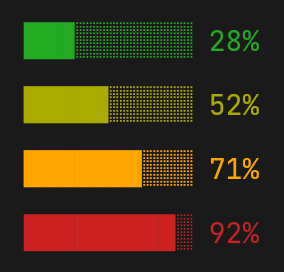
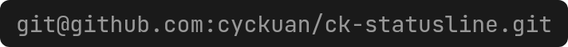

# [CK-CCS] Claude Code Status Line

A Claude Code plugin that displays a custom status line with a company badge, context utilisation, session tokens, system metrics, and git context. Automatically switches between dark and light colour schemes. Cross-platform (Linux, macOS, Windows).


## Elements (left to right)

### Company Badge


A configurable company name rendered on a coloured background. Supports inline ANSI codes for per-character styling. Separated from the rest of the statusline by a space (no pipe separator).

**Why:** Gives visual brand identity to your terminal, making it immediately obvious which organisation's environment you're working in — useful when switching between personal and work contexts.

### Context Utilisation Bar


A 10-character progress bar showing how much of the context window has been consumed. The percentage accounts for a 16.5% auto-compaction buffer — the bar represents usable context, not raw remaining percentage.

**Why:** Context exhaustion triggers automatic compaction which summarises earlier conversation, potentially losing nuance. Knowing how full the window is lets you decide when to start a fresh session or break complex work into smaller conversations.

**Traffic light colours:**



| Colour | ANSI Code | Default Range | Meaning |
|--------|-----------|---------------|---------|
| Green | `[32m` | 0–39% | Plenty of room |
| Yellow | `[33m` | 40–59% | Moderate usage |
| Orange | `[38;2;255;165;0m` (true colour) | 60–79% | Getting full, consider wrapping up |
| Red | `[1;31m` (bold) | 80–100% | Near compaction, expect summarisation soon |

**Configurable thresholds:** The transition points between colours are set in `config/colors.json` under `context_bar.thresholds` as an array of three values `[green→yellow, yellow→orange, orange→red]`. The defaults are `[40, 60, 80]`. For example, to shift to a more conservative scheme that warns earlier:

```json
"thresholds": [30, 50, 70]
```

### Model


The current Claude model name and version, parsed from the model ID (e.g. `claude-opus-4-6` becomes `opus 4.6`). Falls back to the display name if the ID format is unrecognised.

**Why:** Different models have different capabilities, speed, and cost profiles. At a glance you can confirm you're on the right model for the task — avoiding accidentally burning expensive Opus tokens on a simple question better suited to Haiku.

### Agent Count


Agents dispatched this turn / total agents dispatched this session. Parsed from the session transcript file by counting `Agent` tool calls. Only shown when total is greater than zero.

**Why:** Subagents run concurrently and consume tokens independently. Tracking how many have been launched helps you gauge parallelism, estimate cost, and understand why CPU/memory might be spiking.

### Tokens


Three token metrics:

- **`cum`** — running cumulative total across all sessions. Persisted to `config/cumulative-tokens.json` and never reset by `/clear`.
- **`ses`** — current session total (input + output) from the transcript file.
- **`i:o`** — input-to-output token ratio (rounded to nearest integer). High ratios (e.g. 400+) are normal in long conversations since each turn re-sends the full context.

Token values are formatted as `k` (thousands) or `M` (millions). Input includes `input_tokens`, `cache_creation_input_tokens`, and `cache_read_input_tokens`.

**Why:** Tokens directly correlate to cost. The cumulative counter lets you track spend across an entire working day even through `/clear` resets. The i:o ratio reveals whether your conversation is efficient (low ratio = more output per input) or whether the growing context is dominating cost (high ratio = re-sending large context for small responses).

### CPU %


Current system CPU utilisation, coloured with traffic-light thresholds. Platform-specific:
- **Linux**: sampled over 100ms from `/proc/stat`
- **macOS**: via `top -l 1`
- **Windows**: via `wmic cpu get loadpercentage`

**Why:** Claude Code operations (builds, tests, linters) compete for CPU with the rest of your system. Sustained high CPU can slow response times and indicates heavy background work — a signal to wait before launching more parallel agents.

### Memory


System memory usage as percentage and absolute GB used, coloured with traffic-light thresholds. Platform-specific:
- **Linux**: `/proc/meminfo` (MemTotal minus MemAvailable)
- **macOS**: `sysctl hw.memsize` + `vm_stat`
- **Windows**: `wmic OS get FreePhysicalMemory,TotalVisibleMemorySize`

**Why:** Memory pressure causes swap thrashing which dramatically slows everything. Watching this metric helps you decide whether to close other applications or avoid memory-heavy operations like large builds or running multiple containers alongside Claude Code.

### Working Directory


Basename of the current working directory.

**Why:** Claude Code can change directories during tool execution. A quick glance confirms which project you're in without running `pwd` — essential when managing multiple repositories.

### Git Branch


Current HEAD branch name. Only shown when the cwd is inside a git repository.

**Why:** Prevents accidentally committing to the wrong branch. One glance confirms you're on your feature branch rather than `main` before asking Claude to make changes.

### Git Remote URL



The `origin` remote URL. Only shown inside a git repository.

**Why:** Confirms which upstream you're pushing to — critical when working across forks, or when a repo has both personal and organisation remotes configured.

### Commits Behind


Number of commits the local branch is behind `origin/<branch>`. Only shown when greater than zero — indicates a `git pull` is needed.

Note: uses locally cached remote refs. Run `git fetch` to update.

**Why:** Working on a stale branch leads to merge conflicts. This early warning lets you pull before diverging further — saving painful rebases later.

## Colour Configuration

Edit `config/colors.json` to customise colours. The file contains separate `"dark"` and `"light"` schemes — the script auto-selects based on Claude Code's current theme (`output_style.name`). Any theme name containing "light" uses the light scheme; everything else uses dark.

Values are ANSI escape code suffixes (everything after `\x1b`).

```json
{
  "company": {
    "text": "[1;97mA",
    "background": "[41m"
  },
  "dark": {
    "context_bar": { "green": "[32m", "yellow": "[33m", "red": "[1;31m" },
    "tokens": { "label": "[2m", "value": "[97m" },
    "agents": "[1;95m",
    "cpu": { "label": "[2m", "value": "" },
    "memory": { "label": "[2m", "value": "" },
    "cwd": "[36m",
    "git_branch": "[1;96m",
    "git_remote": "[2m",
    "git_behind": "[33m",
    "separator": "[2m",
    "reset": "[0m"
  },
  "light": {
    "context_bar": { "green": "[32m", "yellow": "[38;5;208m", "red": "[1;31m" },
    "tokens": { "label": "[90m", "value": "[30m" },
    "agents": "[1;35m",
    "cpu": { "label": "[90m", "value": "[30m" },
    "memory": { "label": "[90m", "value": "[30m" },
    "cwd": "[1;34m",
    "git_branch": "[1;36m",
    "git_remote": "[90m",
    "git_behind": "[38;5;208m",
    "separator": "[90m",
    "reset": "[0m"
  }
}
```

### Company badge

The `company.text` field supports inline ANSI codes using `[` as the escape prefix:

```json
"text": "[1;97mA[22;37mCME"
```

This renders **A** in bold bright white and `CME` in grey. Set `"text": ""` to disable the badge entirely.

### Common ANSI codes

| Code | Effect |
|------|--------|
| `[30m`–`[37m` | Standard colours (black, red, green, yellow, blue, magenta, cyan, white) |
| `[90m`–`[97m` | Bright colours |
| `[40m`–`[47m` | Standard background colours |
| `[1m` | Bold |
| `[2m` | Dim |
| `[3m` | Italic |
| `[4m` | Underline |
| `[22m` | Normal intensity (cancel bold/dim) |
| `[38;5;Nm` | 256-colour foreground (N = 0–255) |
| `[48;5;Nm` | 256-colour background |
| `[38;2;R;G;Bm` | True colour RGB foreground |
| `""` | No styling (inherits terminal default) |

## Platform Support

| Platform | CPU | Memory | Agent Count | Git |
|----------|-----|--------|-------------|-----|
| Linux | `/proc/stat` | `/proc/meminfo` | `grep` + `tac` | `git` CLI |
| macOS | `top -l 1` | `sysctl` + `vm_stat` | `grep` + `tail -r` | `git` CLI |
| Windows | `wmic cpu` | `wmic OS` | Pure Node.js | `git` CLI |

## Security

- All external inputs (transcript path, branch names) are shell-escaped before use in commands
- Branch names are validated against `/^[\w\-\/.]+$/` before interpolation
- Transcript paths must end in `.jsonl`
- Config file is read only from the plugin's own directory

## Installation

1. Clone the repository:

```bash
git clone git@github.com:cyckuan/ck-statusline.git ~/cc/ck-statusline
```

2. Add the following to your `~/.claude/settings.json`:

```json
{
  "statusLine": {
    "type": "command",
    "command": "node \"~/cc/ck-statusline/scripts/statusline.js\""
  }
}
```

Replace the path if you cloned to a different location.

3. Restart Claude Code. The status line appears on the next session.

## Uninstallation

**From within Claude Code:**

Run the `/uninstall-statusline` slash command.

**From the terminal:**

```bash
node ~/cc/ck-statusline/scripts/uninstall.js
```

Both methods remove the `statusLine` entry from `~/.claude/settings.json`, reverting to no status line. The plugin files remain on disk — delete the directory manually if you no longer need them:

```bash
rm -rf ~/cc/ck-statusline
```

## Conditional Display

Elements that may be absent or zero are omitted:

- Company badge: hidden if `company.text` is empty
- Context bar: hidden if no remaining percentage provided
- Agents: hidden when total is 0
- Tokens: hidden if no transcript path or file unreadable
- Git branch/remote/behind: hidden when cwd is not inside a git repository
- Commits behind: hidden when up to date (0 behind)
